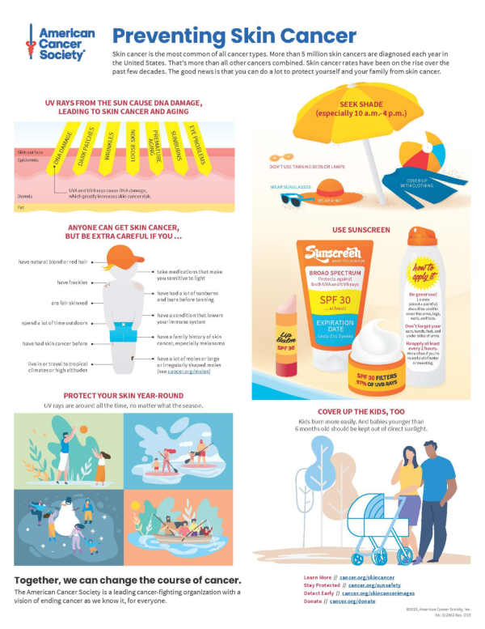
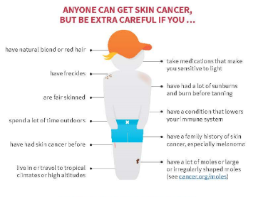
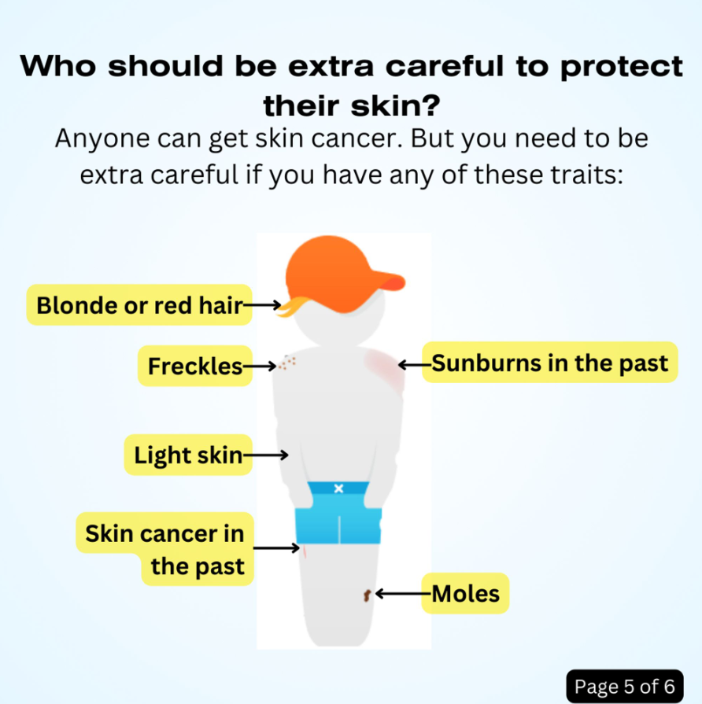
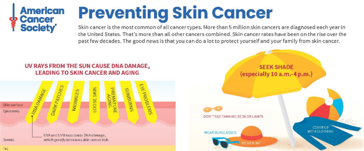

## 1-Minute Takeaways

This article aims to spread health literacy evidence and best practice online. If you only have a minute, here are 3 takeaways to enhance your health communication today:

- **Include relevant illustrations.** Example: remove distracting info from a figure.
- **Use active voice.** Example: Phrase recommendations as commands or actions.
- **Help people solve problems.** Example: Provide the least info to help someone understand a recommendation.

These tips come from the [Suitability Assessment of Materials](https://aspiruslibrary.org/literacy/sam.pdf) (SAM). Use the SAM to improve your written health communication.

--------

## Today's Glow Up: Readability of a Skin Cancer Prevention Infographic

Today's Glow Up focuses on readability. I'm using a multi-panel [infographic shared in a printable PDF format](https://www.cancer.org/content/dam/cancer-org/online-documents/en/pdf/infographics/dont-fry-skin-cancer-prevention.pdf). See the American Cancer Society website for the [infographic's text alternative](https://www.cancer.org/cancer/risk-prevention/sun-and-uv/skin-cancer-prevention-infographic/skin-cancer-prevention-text-alternative.html).

On first glance, there is a lot to like about this graphic. Its title is short, informative, and easy to read. Its source is clear. Its use of bright, streamlined illustrations is inviting. Its distinct sections make it seem like a quick read.

At the same time, a few Glow Up-worthy features jumped out at me. So, I used questions from the Suitability Assessment of Materials (SAM), by Doak, Doak, and Root. It focuses on readability through writing and design features.

---

### Are Your Illustrations Relevant to Your Message?

The SAM promotes using relevant images. Readers should be able to "grasp the key ideas from illustrations alone. No distractions." I highlight one illustration that could use a little editing to this end.

I like the way this illustration shows some of the key points on this stick figure. For example, it's handy that it points to fair skin, freckles, and sunburns to illustrate risk factors directly on the stick figure. But it also includes distractions. For example, it's confusing to point to the figure's ankle to illustrate a tropical climate. This illustration includes a few points that aren't actually illustrated. So, I streamlined it.

This edit focuses on visible risk factors. I sacrificed detail for the sake of readability and length. I also think a separate table might be more helpful to display the less visible risk factors, e.g. family history.

My edits turned the previous heading into a contextual statement: "Anyone can get skin cancer. But you need to be extra careful if you have any of these traits." This helps the figure itself answer the question I put as the illustration's title: "Who should be extra careful to protect their skin?"

I also included page numbers to helped organize the different sections. This is a design choice I would make to clarify the original infographic's reading order.

---

### Does Your Health Communication Use Active Voice?

The SAM promotes a conversational writing style. To receive a superior rating, the material should use active voice throughout. Active voice describes a sentence where a subject performs an action. The infographic includes an instance of passive voice I want to highlight:

> "And babies younger than 6 months old should be kept out of direct sunlight."

This is a typical passive voice sentence. It doesn't answer the question of who performs the action. Who should keep babies out of direct sunlight? It's unclear. But there are lots of ways to provide that info. I came up with the sentence below:

> "Keep babies younger than 6 months out of direct sunlight."

Who should keep babies out of direct sunlight? You, the reader. Even so, we could target this info more. For example, this sentence could appear under a heading like, "How do I protect my kids from skin cancer?"

---

### Does Your Health Communication Focus on Helping People Solve Problems?

The SAM promotes content that helps people solve problems. To receive a superior rating, the material should focus on actions rather than facts.

This infographic begins with a summary of skin cancer rates. Below that text are two graphics. One shows layers of skin and lists the effects UV rays can have. The other uses a beach scene to show ways to seek shade and cover up. I thought this second graphic was action oriented. But I thought the other two sections provided too many facts for a short infographic.

This infographic uses bright simplistic imagery. However, it's easy to miss how much info is actually in each section. I edited this by focusing on what would help someone protect their skin. So, I decided to combine the skin layer graphic and intro paragraph into a short intro page. It gives minimal info to explain why protection from the sun is important. It also acts as a summary, providing the main points for someone who might not read past the first section.

Edit your health communication with a focus on actionability. This can help you focus on the most important details. You might not communicate every fact you want to, but you'll make it easier for someone to read the whole thing.

---

### A Focus on Health Equity

 If I were to make new content for this infographic, I'd address health equity. For example, many people's jobs might be their main source of sun exposure. Seeking shade and covering up might not be straightforward in these cases. Providing tailored advice might help.

There's also the fact that the infographic focuses on light skin as a risk factor. This focus might hide the higher skin cancer death rates among Black people than white. This is not just a medical issue. It is a social and political issue tied to systemic racism. Acknowledging this situation is important. And communication around screening for all people might help. Now, cancer screening isn't the same as preventing cancer. But it is related to preventing cancer deaths. So, it'd be worth including.

Finally, it's important to keep in mind accessibility. The original infographic comes with a text alternative that uses HTML heading structures. This is a good practice to use in your own work. A next step might be to split up the sections across two pages for a double-sided print. This way, the fonts on paper versions could be larger.

---

## Summary

 This article used a health literacy assessment to edit a public health infographic. It provided three tips to enhance your health communication:

1. Include relevant illustrations.
2. Use active voice.
3. Help people solve problems.

It also emphasized the importance of addressing health equity in a "general audience" material. (Note: I published a [version of this article on LinkedIn](https://www.linkedin.com/pulse/health-literacy-glow-up-1-elevate-communication-practices-mendez-1f), on September 20, 2023.)