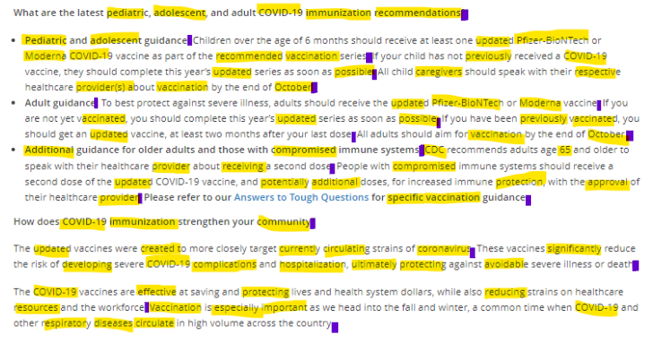

## 1-Minute Takeaways

If you only have a minute, here are 2 takeaways to enhance your writing right now.

- **Replace words with more than 2 syllables.** Highlight each of these longer words and start rephrasing. This won't make your text 100% more readable, but it is a great start.
- **Break up sentences.** Highlight the ends of sentences and start cutting them in two, especially if you see a sentence go on for multiple lines Using shorter, choppier sentences is fine.

These tips are based on the SMOG reading grade level formula. If you want a. Follow the (SMOG guide I wrote for the Harvard School of Public health)[https://hsph.harvard.edu/research/health-communication/resources/smog/]. Or paste your text into a web app like the (SMOG calculator from Text Compare)[https://www.readabilit.com/readability/smog-index]. That said, you don't need to do any math to benefit from the SMOG. Combing through your text with these two tips might be enough. In practice, this can be a better use of time than trying to use the SMOG the "right" way. 

---

## Today's Glow Up: COVID-19 Data Visualization

Today's Glow Up improves a text about new COVID-19 vaccines from the (Public Health Communications Collaborative (PHCC))[https://publichealthcollaborative.org/topics/vaccine-development-safety-and-effectiveness/]. At first glance, this text has really helpful features. It uses clear headings for structure. It uses bullet lists to break up key points. It also uses a handy Q&A format. (Note, this blog post looks at the August 2025 update to this page. Check the PHCC website for the latest info).

I also see some things that are worthy of a Glow Up. I used the SMOG formula to highlight spots I want to edit. Here's how that worked:

1. I looked at 30 sentences.
2. I counted words with more than 2 syllables: 124.
3. I calculated the square root of 124: close to 11.
4. I added 3 to get the SMOG score: 14.

This number is the text's reading grade level estimate. It has a score higher than 12. So, I don't expect to reach someone with a high school education if I use this text. Keep in mind: this is a rough guide. It would be better to test your text with audience members.

But we don't always have support for testing. Even when we do, we don't always get more than one chance. This is a problem our health systems and government officials can address through more robust public health funding. Meanwhile, we still need to share key messages. So, I recommend a life hack to make the most of our time.

---

### Use the SMOG without using the SMOG

To use the SMOG, you highlight words with >2 syllables. This includes acronyms like "CDC". This also includes proper nouns like "October." You also highlight sentence endings. Note: when I say, "highlight" I mean it.

When you highlight that many words, you get a good idea of where to start with your edits. When you notice a sentence stretch on for 3 lines, you get a good idea of where to start.

### Replace Long Words and Chop Up Sentences

Let's dive into a short example. Here, I bolded words with >2 syllables:

> **Every** vaccine goes through a **transparent** and **rigorous** **development** process. Vaccines are **constantly** **monitored**, from the early stages of research to their public release, and beyond.
> Some vaccines **undergo** a **shorter-than-usual** timeline for the standard **development** and testing phases. These vaccines are **developed** quickly because of decades of **previous** vaccine research, global **collaborations**, and **overlapping** **development** and testing phases.

Notice how many words are in bold: 14. Without doing any math, I know that's more than I would want in such a short passage. This makes me want to replace some words with synonyms. Replace some words with shorter forms. And just cut out some phrases.

Notice how many sentences are in this passage: 4. Doesn't it feel like there are more than 4 key ideas? This makes me want to break down compound sentences. Without doing any math, I made some edits:

> All vaccines goes through a strict research and testing process. Research findings are public. The **FDA's** **decisions** are public. This process has strict rules, from research to release, and beyond. Some vaccines go through a shorter process because they build on prior research and global **collaborations**.

Instead of 14 bolded words, I have 3. Instead of 4 long sentences, I have 5 sentences of varied length, using fewer words overall. How did I do this? I cut down redundant wording. I focused more on key ideas. I highlighted facts that would relate more closely to a reader's personal health concerns.

In this excerpt, I still used some complex words and abbreviations. But this is a great start. After editing the rest of the text, we might end up with something short enough to use on social media. We might end up with Q&A segments to fit in small pamphlets. We might have texts that double as scripts for community health workers

---

### A Focus on Health Equity

The original message does not address the fact that people face different levels of risk for getting COVID. And ending up in the hospital with COVID. And dying from COVID. This reality is unjust. If you don't address this, you risk missing key readers.

Some risk comes from unsafe worksites. Some risk comes from discrimination in doctors' offices. Some risk comes from underfunded health clinics. It's key that people who face these kinds of risks can get a new COVID vaccine this fall.

So, yes. Make your message as readable for as many people as you can. And also make your message relevant. How can you write your message to address the problems people face every day? How can you work with local partners to make sure your message hits home? How can you advocate for more protections?

I admit this is easier said than done. It's also more important than ever.

---

## Summary

This article used the SMOG formula to edit a public health text. It provided 2 tips to enhance your health communication:

1. Replace words with more than 2 syllables. Use the SMOG if you need help setting a concrete goal.
2. Chop up sentences. Use one sentence to share one idea. 

It also emphasized the importance of addressing health equity in a "general audience" material. (Note: I published a [version of this article on LinkedIn](https://www.linkedin.com/pulse/health-literacy-glow-up-covid-vaccine-communication-text-mendez), on October 4, 2023.)
