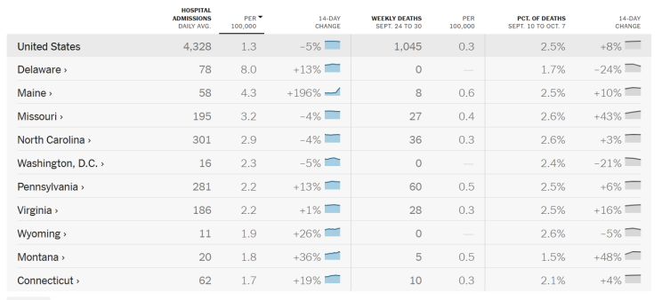
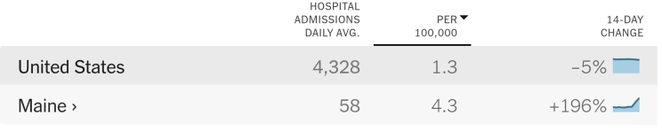
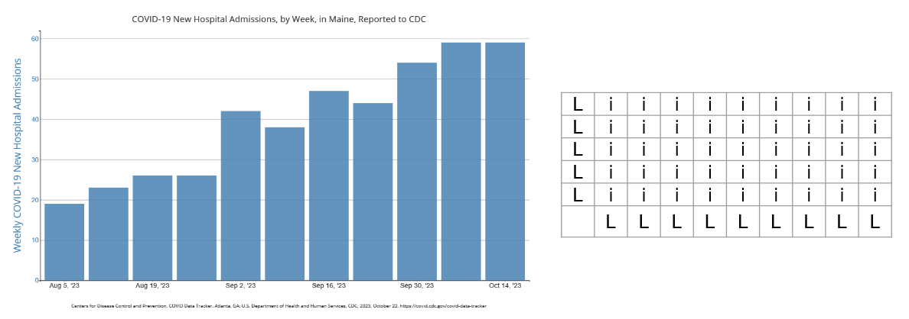
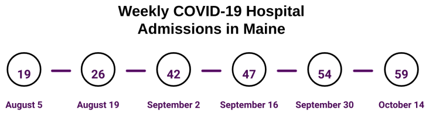

## 1-Minute Takeaways

This article aims to spread health literacy evidence and best practice so you can use data more effectively in your communication. If you only have a minute, here are some tips to enhance your health communication right now.

- Use lists rather than tables.
- If you must use a table, use tables that only need column labels. These are clearer than tables that need both column labels and row labels.
- If you must use a table with column labels, avoid tables with sub-columns.
- Avoid using graphs.
- If you must use a graph, use an icon array or a timeline rather than bar/line graphs.
- If you must use a more complex graph, avoid graphs that require a key, like those with stacked bars or nested lines.

These tips come from the [PMOSE/IKIRSCH](http://www.makingnumbersmeaningful.org/documents/pmose.pdf). It tells you how dense your document is with information. 

---

## Today's Glow Up: COVID-19 Data Visualization

For today's Glow-Up, we'll focus on sharing public health data. Let's start with data from the New York Times COVID dashboard. Let's say we want to discuss the need for COVID safety in Maine. We might copy and paste hospitalization data, as in the screenshot below. (Note, this blog post uses data from 2023 for educational purposes around data visualization. Do not rely on this post as an up-to-date guide on COVID-19 transmission.)

This table mixes different kinds of data, including: raw numbers of hospital admissions, hospitalization rates per 100,000, and percentage changes. (Screenshot from Oct. 20, 2023). When we assess it with the PMOSE/IKIRSCH, we see that it has an intersected list structure. This means rows and columns both have labels to keep track of. There are 18 labels and 99 data points. In total, this means someone would need some high school education to interact with it. That might be fine for the New York Times. But we need some edits if we want to reach more people.

---

### Step 1: Reduce the Data Points

Our first step is to reduce the number of data points. Start by asking: why do we want to share data? Our answer will guide our edits.

Let's say we want people in Maine to get an updated COVID vaccine as soon as they can. Data can help show how fast COVID is spreading. Showing this spread might be part of our message strategy. In this case, we might just need 2 rows in our table. The Maine row is relevant to our readers. And the US row provides context. We might then focus on hospitalizations, since those numbers change closer to real-time.

This new, smaller table still has an intersected list structure. But now it has 5 labels and 8 data points. This means we reduced the complexity to a middle school level.

### Step 2: Streamline the Structure

With so few data points, we should ask a new question. Do we even need an intersected list? (In other words, do we need a table with row and column labels?)

Our next edit targets a simpler structure. One option is a simple bulleted list for the Maine data. If we want, we can add a separate list for the US data. Another option is to just use text. (Source: CDC, October 2023.):

> In Maine last week, 59 people went to the hospital with COVID. This is triple the weekly amount from 2 months ago. This is a big deal, since COVID hospitalizations are actually going down in other parts of the country.

This text alone might suffice. But what if we want a graph to show trends over time? Then a bar chart or line graph makes sense.

keep in mind: these are as complex as our table from before. Such graphs also have an intersected list structure. To make sense of the data, you need to keep track of 2 axis labels. This is similar to our earlier table, with labels for columns and rows. But you might know your audience prefers this to a table. Or you might  present both so people have the option.

A clearer option is a timeline:

This timeline doesn't visualize the rise in hospitalizations. But it is more readable than a graph. We might also consider a table, since this simple timeline doesn't require row labels. Does this mean it is perfect? No. Does this mean it is suitable for everyone we want to reach in Maine? No. But it is much clearer than what we started with. And it's a worthy alternative to a bar chart.

---

## A Note on Dependencies

A "dependency" is info someone needs to make sense of your document, which they must find elsewhere. For example: the date of their last COVID vaccine. A dependency adds a point your document's PMOSE/IKIRSCH score. That's the same as going from a simple bar graph to a stacked bar graph. Or adding many rows and data points to a table.

Now, you might need to ask someone to refer to outside info in your message. That's even more reason to streamline the rest of your message, including tables and graphs.

## A Note on Accessibility 

The PMOSE/IKIRSCH addresses accessibility via literacy demands. However, broader web accessibility guidelines are just as important.

Even if you make the perfect graph, you must assume some people will never interact with it. All people do not perceive the same content the same way. Some people use screen readers, which rely on text data and HTML structure rather than visual info. Some people use magnifiers, which means certain on-screen interactions might be impractical. Some people might perceive the shapes and patterns in your data visualization, but not all the colors.

Web accessibility requires more time and attention than I can devote here. And I still have lots to learn myself. But I can offer a few tips:

- Include alt text for all images that carry info.
- Use text to summarize the main points of data visualizations.
- Use tables to share tabular data. (Not for visual formatting!)
- Use actual HTML tables rather than images of tables or visually formatted text.
- Learn more image [accessibility tips from W3](https://www.w3.org/WAI/tutorials/images/tips/).

Data visualization can be fun, informative, and impressive. But in public health, we don't make them just for fun. We make them for strategic communication. We should always ask ourselves how to make our work more readable and more accessible.

---

## Summary

This article used the PMOSE/IKIRSCH to help adapt COVID hospitalization data for public messaging. It provided 2 tips to enhance your health communication:

1. **Reduce data points.** Use the PMOSE/IKIRSCH scores to help set goals.
2. **Streamline the structure.** Use the PMOSE/IKIRSCH scores to choose a slightly clearer structure. For example, use timelines instead of line charts.

It also emphasized the importance of addressing accessibility in a "general audience" material. (Note: I published a [version of this article on LinkedIn](https://www.linkedin.com/pulse/health-literacy-glow-up-covid-spread-data-samuel-mendez-zaoec), on October 20, 2023.)