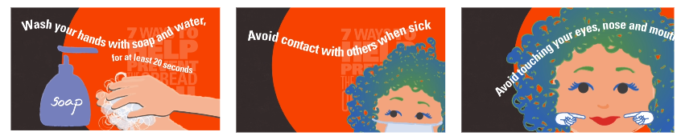
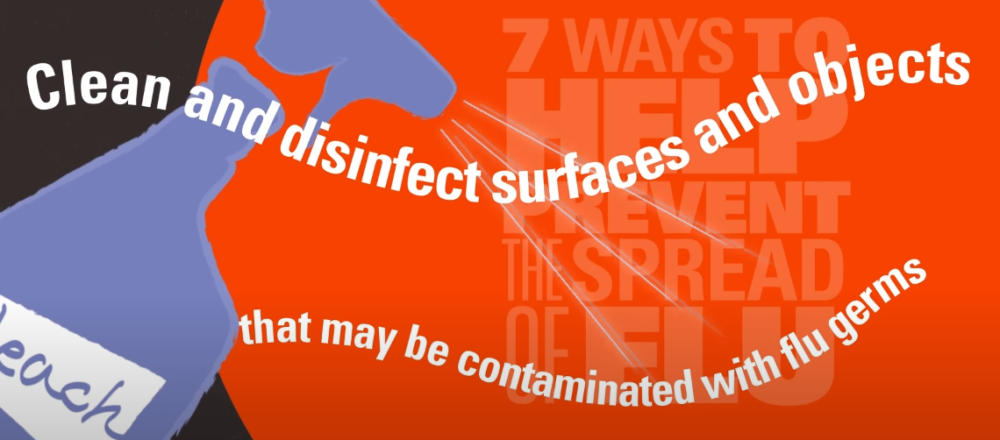
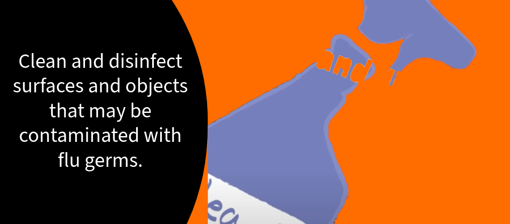

## 1-Minute Takeaways

This article aims to spread health literacy evidence and best practice so you can make your videos more effective. If you only have a minute, here are some tips to enhance your health communication right now.

- Include at least one call to action. Break the action down into distinct steps to make it even clearer. 
- When writing your call to action, use commands. Don’t just list facts, as in: “Wearing a mask in crowded spaces can help reduce COVID risk.” Give a command, as in: “Wear a mask in crowded spaces to help prevent getting sick.”
- Organize your video into distinct sections. Put those sections in a logical order. - Use headings to clearly separate and announce the video's sections.

These tips come from the [PEMAT-A/V](https://www.ahrq.gov/sites/default/files/publications/files/pemat-av.pdf). It tells you how actionable and understable your audiovisual material is.

---

## Today's Glow Up: A Video on Flu Prevention

Let's take this flu [prevention video from MD Anderson Cancer Center](https://www.youtube.com/watch?v=qKYjj4VTksI). It's titled "7 ways to help prevent flu germs from spreading."

https://www.youtube.com/watch?v=qKYjj4VTksI

 Here is a transcript of the video's tips:

>Wash your hands with soap and water, for at least 20 seconds. Avoid contact with others when sick. Stay home for at least 24 hours after your fever is gone if you have flu-like symptoms. Cough or sneeze into your elbow, or cover your mouth and nose with a tissue when you sneeze—and throw it away when you're done. Avoid touching your eyes, nose and mouth. Clean and disinfect surfaces and objects that may be contaminated with flu germs. Take antiviral drugs like Tamiflu if your doctor prescribes them. It could mean the difference between having a milder illness and a serious one that requires hospitalization. 

This video has a few key strengths. It uses streamlined graphics and bold colors. It's concise, lasting less than 1 minute. The title is clear. And the content supports specific health behaviors.

At the same time, it has some room to improve. Let's look at some questions from the PEMAT-A/V to learn how. 

### Make Your Video Understandable

This video is so short that only one organization question from the PEMAT-A/V applies. Does the material present information in a logical sequence? I would say no. Though the other questions don't technically apply, they can still help us plan our edits.

There isn't a clear structure to this video. The tips in the video start off with flu prevention. Then it gives advice for when you have the flu. Then it goes to back to prevention. Then it recommends Tamiflu, which doesn't clearly relate to stopping the flu's spread.

Though it's short, the video would benefit from distinct sections with headings. The first heading could be: How do I avoid getting the flu? The second heading could be: How do I avoid getting others sick when I have the flu? These chunks make sense under the title of this video. And they would help someone find info that matches their current situation.

Another section of the PEMAT-A/V prompts you to think about word choice. Ideally, you would get feedback from audience members to this end. At the very least, this should be a prompt to look at uncommon words. For example: "disinfect" and "contaminated."

 The advice to clean and disinfect contaminated surfaces is complex. Though it's one sentence long, it assumes a lot of background knowledge. A viewer needs to know what it means to both clean and disinfect. They need to know how to disinfect different kinds of surfaces. They need to know what a germ is. They need to know how flu germs spread.

Swapping out the uncommon words is a good start. However, this is also an issue of actionability. 

### Make Your Video Actionable

 A key question from the PEMAT-A/V prompts you to break down advice into clear, manageable steps. Here's how we might break down the "clean and disinfect" advice:

- Identify objects with hard surfaces you touch often. Example: doorknobs, tabletops, and remote controls.
- Clean the hard surfaces with a disinfectant. Example: Clorox wipes or a bleach spray.
- Identify objects with soft surfaces you touch often. Example: blankets, couches, and stuffed animals.
- Wash smaller soft objects with soap and hot water. Clean larger soft objects with a steam cleaner.
- If you can't clean a surface, you can at least wash your hands after touching it. Flu germs can infect you even after sitting on a surface for a day.

This list shows how much background knowledge the video assumes. And this doesn't even address the lack of an explicit audience. Is this tip for a caretaker of someone with the flu? Is it for someone with the flu right now? Is it for someone who doesn't want to get sick during flu season? 

This edit shows how understandability and actionability can work together. The answer to these questions could be clearer if we divided the video into distinct chunks with headings. If this video grouped the advice by audience, then we could do so without adding that explanation to every tip.

Unfortunately, this advice is now much longer. However, I think it's worth it to make it more actionable and understandable. This might prompt me to cut other parts of the video for a more targeted message. Example: this video could just focus on flu prevention when someone in your home is sick. This video would better ensure that people have the info to do a couple key actions well. I would prefer this to a video that covers more ground but assumes a lot about its audience.

---

### Make Your Video Accessible

Though the PEMAT-A/V is helpful, it doesn't address key principles of [web accessibility](https://www.w3.org/WAI/fundamentals/accessibility-principles/#perceivable). We'll focus on one key principle for this video: perceivability.

 In health communication, everyone should be able to sense your message. Our example video relies purely on vision to share its message. It uses text on screen, with no voiceover or text alternative (at least on YouTube). This will work for a lot of people, but someone with low vision might not sense any of the information. Someone with colorblindness might not make out the white text against the vermilion background. Someone with ADHD and dyslexia might not read the moving, swirling text against the dynamic animated backgrounds.

We could rework the graphics to make the video accessible to more people who would see it. One issue is the swirling text. We could instead have the text fade in or slide in, but stay still so more people could keep up with it. We could keep the text against a very dark background so more people could make out the words. This doesn't mean we have to give up the video's dynamic animations. Instead, we could use a specific part of the screen for them.

But these edits still assume someone will see the video. A narrator might help a lot more people access the info in this video. If we broke down advice into smaller actionable steps, an audio description might also help. For example, the video might show examples of disinfectants. In this case, we would want to make sure someone didn't have to see the video to know what those are. 

We might do this through a narration with descriptions built in. Example:

https://www.youtube.com/watch?v=JUfmCvdzqbM

We might also do this through making and sharing a separate video with a new audio description track. Example:

https://www.youtube.com/watch?v=KdBK1EHkowQ

 We would also want to make sure we share a text alternative when we share this video. This way, someone using a screen reader or limited mobile data can access our message. This video is short enough that we could also include the transcript directly in the video description.

These are just a few examples of how we might make a video accessible to more people. Check out these [stories of web users](https://www.w3.org/WAI/people-use-web/user-stories/) from the Web Accessibility Initiative for more insight.

---

## Summary

Advancing health equity is part of public health. And that means learning how to build a culture of health literacy and accessibility. This article used a flu prevention video as an example of these concepts working together. To make the video clearer, we could target a more specific audience. To make the video more actionable, we could give that audience smaller steps to follow. To support those steps, we could include more specific illustrations. To make sure all of this info is perceivable, we could use a different visual design, add a narrator, and include text alternatives. The PEMAT-A/V is an important tool to start with. But it's even more helpful if you pair it with accessibility guidelines.

(Note: I published a version of [this article on LinkedIn](https://www.linkedin.com/pulse/health-literacy-glow-up-flu-prevention-actionable-videos-mendez-3ghmc/), on November 4, 2023.)