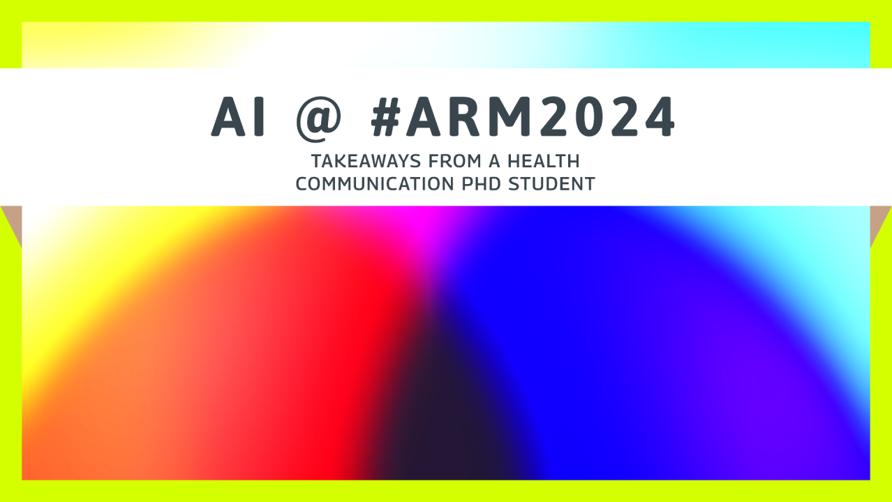

 _Health Literacy and AI_ is a series about how tools like large language models (LLMs) and machine learning are changing the way we share health info. I break down what’s working, what’s not, and what’s next. I draw from my own research combining AI and health literacy. The goal: better, fairer health info for all.

In this first post of the series, I look at how AI tools claim to solve health communication problems. I share why these tech solutions fall short. And why that's more important now than ever. No tool can replace human-centered health messaging or fix the deep gaps in health access. 

---

## AI Dominates the Conversation

Two years ago, the Baltimore Convention Center transformed into an AI showcase for the [ARM 2024 conference](https://www.linkedin.com/pulse/artificial-intelligence-health-communication-arm2024-samuel-mendez-vbkpc/?lipi=urn%3Ali%3Apage%3Ad_flagship3_pulse_read%3B6w%2Bw6MQnSQSAlTRP5ATsog%3D%3D). Dozens of presenters discussed the impact of artificial intelligence on key areas of healthcare. Pharmaceutical development. Clinical documentation. Teaching. Patient advocacy. I had trouble making my own schedule, knowing I couldn't attend them all.

I took the popularity of these tools as a sign that my [PhD research examining AI for health literacy](https://health-literacy.ai/) was addressing a timely professional need. 

## Public Health Is Not Okay

 (Credit to [Dr. Katie Schenk](https://phworkforceok.substack.com/) for this turn of phrase, by the way).

The [US needed bout 80,000 more public health workers in 2021](https://debeaumont.org/staffing-up/). This would have meant a huge funding increase to hire 80% more staff than we had. And this wasn't just due to new pandemic challenges. Public health was subject to "defunding" for a long time. And that was under both Democrat and Republican administrations.

Then chronic problems became an acute crisis. [Mass firings at federal health agencies](https://www.pbs.org/newshour/show/mass-firings-begin-at-government-health-agencies-including-fda-cdc-and-nih) gutted our ability to respond to disease outbreaks. Federal funding cuts [forced health centers to close](https://www.vpm.org/news/2025-02-04/virginia-community-health-centers-close-federal-funding-grant-access) and [local health departments to cut staff](https://www.idse.net/Tag/Trump-administration/20471). We are well on our way to the vision of public health outlined in [Project 2025](https://www.apha.org/topics-and-issues/public-health-under-threat/project-2025): powerless to help people when they need it.

The timing couldn't be worse. We're facing measles outbreaks. Plus foodborne illness outbreaks. Plus bird flu threats. Plus long-term COVID risks. Plus health impacts from extreme weather, fueled by climate change. Among other key public health services, we need clear communication now more than ever. 

## The Promises of AI in Health Communication

Facing these challenges, it feels like generative AI tools came just in time. It feels like they can fill gaps when staff and funds for health messages run short. Research highlights several key uses where AI tools might show measurable impact on an organization's health literacy:

- [Improve readability of patient info materials.](https://doi.org/10.1093/eurjcn/zvad087)
- [Create content that's more usable and supportive than doctors' writing.](https://www.jmir.org/2024/1/e58831/)
- [Reduce belief in conspiracy theories.](https://doi.org/10.1126/science.adq1814)

But in practice, it's not quite that easy. In public health communication, we need to take a critical look at what technology can actually deliver in context.

## Beyond AI Hype: Technology's Limitations

 What we call "AI" is more of a product of marketing than the technology itself. As [Melanie Mitchell](https://melaniemitchell.me/aibook/https://melaniemitchell.me/aibook/) points out, there is a practical approach to AI focused on doing tasks that we usually think need human brains. But that's a moving target. Once we get used to machines doing something, we stop calling it AI. Think about these everyday AI tools:

- GPS apps finding the quickest route through traffic
- Email systems catching spam messages
- Predictive text finishing your sentences

Today, the term "artificial intelligence" tends to bring to mind generative AI, powered by large language models (LLMs). Think: ChatGPT, Claude, or Gemini. In short, this tech works by predicting what words go together in a sentence. Due to its broad training data, proponents say it can do a wide range of tasks in a wide range of contexts. This has helped the tech spread far and wide. The idea of your doctor drafting a message with the help of an LLM might not surprise you anymore. But this normalization hides key flaws in these tools.

### Benchmarking

Models like those in ChatGPT seem to get more advanced with each update. They do better on tasks like multiple-choice tests and using the right pronoun in a sentence. These tasks make LLMs feel like all-purpose tools when you use them. But those metrics have little to do with clear, usable health communication. In practice, tools like ChatGPT are further trained in response to user interactions. Again, this leads to content that feels good, but doesn't have to do with clear, usable health communication. What does this mean for a health communicator? You can't just take someone's word for it when they say a model performs better. They probably don't care about the same tasks you do. 

https://www.youtube.com/watch?v=kDY4TodQwbg

### Understanding

To use a term from Emily Bender, AI chatbots can be thought of as "[stochastic parrots](https://en.wikipedia.org/wiki/Stochastic_parrot)". Like parrots, they can make something that sounds like human language. But these tools do not understand what that content means. They do not know how it relates to broader shared cultural knowledge. They do not relate to it with a lived experience. At the end of the day, it is still just crunching numbers. The results might be useful. But they might not mean as much as communication that can strengthen relationships by reflecting shared experiences of daily life. 

### Equity

An LLM reflects its training data. That is a fact. Another fact: study after study finds that health communication doesn't meet health literacy standards. This includes [breast cancer communication](https://doi.org/10.1016/j.breast.2024.103722). [Mental health education](https://doi.org/10.1016/j.pec.2023.107682). And [health education more broadly](https://doi.org/10.1177/1062860617751639). How can we expect an LLM to surpass its training data, which is likely filled with unclear, unusable health info? Even if we had enough positive examples to fine-tune it, our ability to manually produce that content at scale might mean we wouldn't benefit from automation.

##  Beyond Technological Solutions

This series isn't meant to be a full-stop argument against generative AI or LLMs. Health literacy jobs are few and far between. In hierarchical organizations, the choice to integrate new technology may not be up to a health communication expert. Demonstrating familiarity with AI may make the difference in hiring or job retention. I hope this series helps you make evidence-based choices. That way you can say specifically how certain tools might help. And what problems they won't solve. And what problems they might create.

The truth is, we will always need health literacy experts to edit AI-generated content. We'll always need health communication experts to shape broader campaigns. We'll need experts from local communities to maintain healthy relationships with the people we want to serve. And the truth is, communication is more than just information. 

 Health literacy represents more than information transfer. It represents more than just individuals' reading skills. It reflects complex social, political, and economic factors that shape who organizations serve best by default. When our field is feeling a squeeze, it won't be easy to gain support for more equitable processes that form human connections. But it's more important now than ever before.

## Research-Driven Approaches to Health Communication Technology 

 My PhD research tested how AI tools handle health information. My current work expands on this to rethink model benchmarking. I'll draw on this experience in coming blog posts, I'll cover:

- Tool reviews of popular AI readability platforms
- Decision guides for choosing when to use (or skip) AI in health messages
- Real examples showing AI health content wins and failures
- Practical tips for keeping people first when using tech tools

We must see tech for what it is: just one tool in our larger work toward health equity.

(Note: I published a version of [this article on LinkedIn](https://www.linkedin.com/pulse/ai-wont-save-health-literacy-samuel-mendez-dogtc/), on May 17, 2025). (Photo credit: Bill Nino).